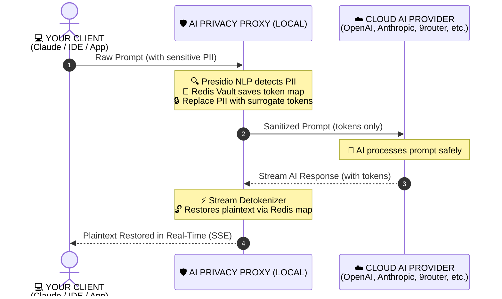

<div align="center">

# 🛡️ AI Privacy Proxy (Cloak AI)

**High-performance, zero-leak privacy gateway & reverse proxy for Cloud LLMs.**  
*Sanitizes sensitive PII before reaching AI providers and transparently restores plaintext in real-time streaming responses.*

[](https://opensource.org/licenses/MIT)
[](https://nodejs.org/)
[](https://fastify.dev/)
[](https://www.docker.com/)
[-emerald.svg)]()

[Features](#-key-features) • [Architecture](#-how-it-works) • [Quick Start](#-quick-start) • [Client Setup](#-client-setup) • [Configuration](#-configuration) • [Security](#-security--compliance)

</div>

---

## 🌟 Key Features

* **🔒 Bidirectional PII Sanitization**: Automatically intercepts prompts, detects personal data, secrets, or financial records, and substitutes them with surrogate cryptographic tokens (`[PREFIX:PERSON_001]`).
* **🧠 Real Presidio NLP Engine**: Backed by Microsoft Presidio Analyzer with spaCy linguistic models, custom regex patterns, and checksum validators (Credit Cards, Crypto Addresses, API Keys, SSNs, IBANs).
* **⚡ Sub-Millisecond SSE Stream Detokenizer**: Replaces tokens on-the-fly inside Server-Sent Events (`text/event-stream`) without breaking chunk boundaries or buffering entire streams.
* **🌐 Multi-Provider Routing & Path Proxies**: Route requests dynamically via URL prefixes (`/p/openai/v1`, `/p/anthropic/v1`, `/p/openrouter/v1`, `/p/9router/v1`) or HTTP headers.
* **🎮 Interactive Live Playground**: Test prompts and models directly inside the dashboard with ephemeral in-memory API keys.
* **📊 Modern Admin Console & Monitoring**: Real-time metrics, live latency graphs, policy simulators, session vault inspection, and privacy audit logs.
* **🛡️ Fail-Closed & Fail-Open Modes**: Switch between `strict` (fail-closed if privacy engine offline), `balanced` (fail-open to local regexes), or `bypass`.

---

## 🔄 How It Works



### 🔬 End-to-End Payload Lifecycle Example

Below is a concrete example demonstrating data transformation across the entire pipeline—from the client, through the Privacy Gateway, to the upstream AI provider and back:

#### 1️⃣ Client Sends Prompt Containing Sensitive PII
Your local client, SDK, or IDE sends a standard API request containing personal names, email addresses, and crypto wallet addresses:
```json
// POST http://localhost:8080/p/openai/v1/chat/completions
{
  "model": "gpt-4o",
  "messages": [
    {
      "role": "user",
      "content": "Please send 2.5 ETH from Alice Walker (alice@techcorp.com) to wallet 0x71C8F794B32145429631994304244a1234567890."
    }
  ]
}
```

#### 2️⃣ Gateway Generates Surrogate Tokens & Stores Mapping in Vault
The proxy intercepts the prompt, detects PII entities via Presidio NLP analyzer, and generates unique cryptographic surrogate tokens:

| Entity Type | Original Sensitive Value | Surrogate Token (Sent to AI) |
|---|---|---|
| `PERSON` | `Alice Walker` | `[8b4b7a8b:PERSON_001]` |
| `EMAIL_ADDRESS` | `alice@techcorp.com` | `[8b4b7a8b:EMAIL_ADDRESS_001]` |
| `ETHEREUM_ADDRESS` | `0x71C8F794B32145429631994304244a1234567890` | `[8b4b7a8b:ETHEREUM_ADDRESS_001]` |

> 🛡️ **Zero-Leak Guarantee:** This mapping is stored securely in an ephemeral in-memory vault with TTL. Real plaintext values are **NEVER** transmitted over the internet or written to log files.

#### 3️⃣ Sanitized Payload Reaches Cloud AI Provider (Zero PII Leak)
The cloud LLM provider (OpenAI, Anthropic, OpenRouter, 9router) only receives randomized surrogate tokens:
```json
// Upstream request received by Cloud AI Provider
{
  "model": "gpt-4o",
  "messages": [
    {
      "role": "user",
      "content": "Please send 2.5 ETH from [8b4b7a8b:PERSON_001] ([8b4b7a8b:EMAIL_ADDRESS_001]) to wallet [8b4b7a8b:ETHEREUM_ADDRESS_001]."
    }
  ]
}
```

#### 4️⃣ Cloud AI Generates Response with Surrogate Tokens
The AI processes the prompt logic and generates a completion referencing the surrogate tokens:
```json
// Raw response returned by Cloud AI Provider
{
  "choices": [
    {
      "message": {
        "role": "assistant",
        "content": "I have prepared the transaction of 2.5 ETH from [8b4b7a8b:PERSON_001] ([8b4b7a8b:EMAIL_ADDRESS_001]) to [8b4b7a8b:ETHEREUM_ADDRESS_001]."
      }
    }
  ]
}
```

#### 5️⃣ Gateway Restores Original Plaintext Transparently to Client
The streaming/non-streaming detokenizer swaps tokens back to their original values in real-time before delivering the response to your client:
```json
// Final detokenized response received by your Client / IDE
{
  "choices": [
    {
      "message": {
        "role": "assistant",
        "content": "I have prepared the transaction of 2.5 ETH from Alice Walker (alice@techcorp.com) to 0x71C8F794B32145429631994304244a1234567890."
      }
    }
  ]
}
```

---

## 🛡️ Supported Privacy Actions & Policies

Every detected entity type can be individually configured with one of the following 5 granular actions:

| Action | Behavior | Example Input | What AI Receives | What Client Receives | Best Used For |
|---|---|---|---|---|---|
| **`TOKENIZE`** | Substitutes PII with a cryptographic surrogate token and dynamically detokenizes it back in the AI response. | `Alice Walker` | `[8b4b7a8b:PERSON_001]` | `Alice Walker` (Restored) | Names, Emails, Crypto Wallets, IP Addresses |
| **`MASK`** | Reversible contextual masking. Masks characters with `*` while keeping context (e.g. `@domain.com`), and automatically restores original plaintext on AI response. | `satoshi@bitcoin.org` | `s***i@bitcoin.org` | `satoshi@bitcoin.org` (Restored) | Contextual prompts where LLM needs domain/suffix clues without seeing raw PII |
| **`REDACT`** | Permanently strips the sensitive value and replaces it with `[REDACTED]`. Irreversible. | `4532-1234-5678-9010` | `[REDACTED]` | `[REDACTED]` | Credit Cards, Social Security Numbers (SSN), Passports |
| **`BLOCK`** | Aborts the request immediately at the proxy with HTTP 400. Upstream AI is never contacted. | `xprv9s21ZrQH143...` | *(Request Dropped)* | `HTTP 400: Request Blocked` | Private Keys, Seed Phrases, API Secrets, Passwords |
| **`PASS`** | Passes the text as-is without any modification or sanitization. | `Open Source Project` | `Open Source Project` | `Open Source Project` | Non-sensitive or whitelisted entities |

### 📋 Out-of-the-Box Supported Entity Recognizers

The proxy includes pre-configured Presidio NLP + Regex + Checksum recognizers:

* **Personal & Identity**: `PERSON`, `EMAIL_ADDRESS`, `PHONE_NUMBER`, `US_SSN`, `US_PASSPORT`
* **Financial & Payment**: `CREDIT_CARD` (Luhn checksum algorithm validation), `IBAN_CODE`
* **Web3 & Crypto Assets**: `ETHEREUM_ADDRESS` (EVM 40-hex), `SOLANA_ADDRESS` (Base58 32–44 chars)
* **Infrastructure & Secrets**: `IP_ADDRESS` (IPv4 & IPv6), `API_KEY` (OpenAI, AWS, GitHub PATs, JWT), `PRIVATE_KEY` (64-hex / PEM), `SEED_PHRASE` (BIP-39 mnemonic 12/24 words), `PASSWORD`
* **Custom Pattern Recognizers**: Add custom regexes & confidence scores directly from the Dashboard UI (e.g., custom employee IDs, internal project codes, API tokens).

---

## 🚀 Quick Start

### 1. Clone & Setup Environment

```bash
git clone https://github.com/your-username/ai-privacy-proxy.git
cd ai-privacy-proxy

# Copy environment template
cp .env.example .env
```

Edit `.env` to set your desired admin password:
```ini
ADMIN_API_KEY=your_secure_admin_password_here
UPSTREAM_BASE_URL=https://api.openai.com
```

### 2. Start All Services with Docker

```bash
docker compose up -d --build
```

### 3. Access Portal & Gateway

* **Admin Dashboard**: [http://localhost:8080/dashboard/](http://localhost:8080/dashboard/)
* **Default Proxy Base URL**: `http://localhost:8080/v1`
* **Direct Provider Base URLs**: `http://localhost:8080/p/:providerId/v1`

---

## 💻 Client Setup

### 1. Claude Code CLI
```bash
export ANTHROPIC_BASE_URL="http://localhost:8080/p/anthropic"
claude
```

### 2. OpenAI Python / Node SDK
```bash
export OPENAI_BASE_URL="http://localhost:8080/p/openai/v1"
export OPENAI_API_KEY="sk-your-openai-api-key"
```

```python
from openai import OpenAI

client = OpenAI(
    base_url="http://localhost:8080/p/openai/v1",
    api_key="sk-your-openai-api-key"
)

response = client.chat.completions.create(
    model="gpt-4o",
    messages=[{"role": "user", "content": "Transfer 2 ETH to 0x71C8F794B32145429631994304244a1234567890 for satoshi@bitcoin.org"}]
)
print(response.choices[0].message.content)
```

### 3. Unified Gateways / Self-Hosted (e.g. 9router)
```bash
curl -X POST "http://localhost:8080/p/9router/v1/chat/completions" \
  -H "Authorization: Bearer sk-your-9router-key" \
  -H "Content-Type: application/json" \
  -d '{
    "model": "gpt-4o",
    "messages": [{"role": "user", "content": "Hello AI"}]
  }'
```

---

## ⚙️ Configuration

| Variable | Default | Description |
|---|---|---|
| `PORT` | `8080` | Proxy server HTTP port |
| `HOST` | `0.0.0.0` | Network binding interface |
| `UPSTREAM_BASE_URL` | `https://api.openai.com` | Default fallback upstream target |
| `PRESIDIO_URL` | `http://presidio:5000` | Presidio Analyzer NLP service URL |
| `REDIS_URL` | `redis://redis:6379` | Redis Token Vault connection URI |
| `PRIVACY_MODE` | `strict` | Privacy policy mode: `strict`, `balanced`, or `bypass` |
| `VAULT_TTL_SECONDS` | `3600` | Expiration time (seconds) for ephemeral session tokens |
| `ADMIN_API_KEY` | `sk_admin_...` | Master secret key for `/admin/*` dashboard authentication |
| `LOG_LEVEL` | `info` | Logging verbosity (`debug`, `info`, `warn`, `error`) |

---

## 🛡️ Security & Compliance

* **Zero-Leak Logging**: Headers containing authorization tokens, API keys, and LLM message payloads are automatically redacted from application log files.
* **SSRF Prevention**: Strict validation on upstream base URLs blocks private IP ranges, loopback addresses, and cloud instance metadata (`169.254.169.254`).
* **Timing-Safe Auth**: Admin API key comparisons use constant-time cryptographic equality checks (`crypto.timingSafeEqual`).
* **Non-Root Containers**: Docker images run under isolated unprivileged user (`USER node`).
* **Memory Ephemerality**: Session tokens in Redis expire automatically after TTL to prevent historical PII retention.

---

## 🛠️ Local Development & Testing

```bash
# Enable corepack and install dependencies
corepack enable
pnpm install

# Run proxy and presidio in development mode
pnpm --filter @ai-privacy-proxy/shared build
pnpm --filter proxy dev

# Run dashboard frontend
pnpm --filter dashboard dev

# Run full test suite & typechecks
pnpm test
pnpm typecheck
pnpm build
```

---

## 📄 License

This project is licensed under the [MIT License](LICENSE).
